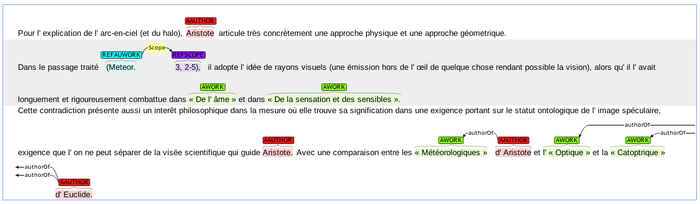

# APh Corpus

authors:

* Matteo Romanello, <matteo.romanello@gmail.com>
* Eric Rebillard

## Data and Goal

The main purpose of this corpus is to support the extraction of named entities--of interest to classical scholars--from secondary sources such as commentaries, journal papers, etc. 

## Content

* **`catalog.csv`** : CSV file with four column
	1. ID
	2. COLLECTION : (legacy information)
	3. TOKEN_COUNT : number of tokens
	4. LANG : abstract language
	5. BiBLIO : bibliographic information about the publication the abstract is about
* **`iob/`** : contains the corpus one record per file stored as IOB format (3 columns: token, POS tag, NE label)
	* the name of each file--excluded the file extension--has a corresponding record in the `catalog.csv` file
* **`txt/`** : contains the corpus as plain text, one record per file
	* the name of each file--excluded the file extension--has a corresponding record in the `catalog.csv` file
* **`ann/`**
* **`extra/`**

## Visualizing and Annotating

## Processing the Corpus

To parse the IOB files using NLTK's conll reader:
	
	import nltk
	corpus = nltk.corpus.reader.conll.ConllCorpusReader('./iob/', '.*\.txt',('words','pos','chunk'))
	corpus.sents()
	corpus.chunked_sents()
	len(corpus.chunked_sents())

## TODO

* manual correction of POS tags
* improve quality and readability of the `biblio` field
